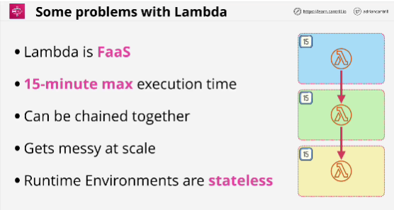
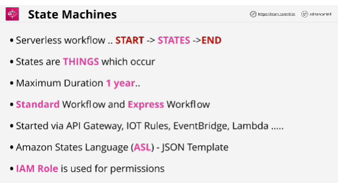
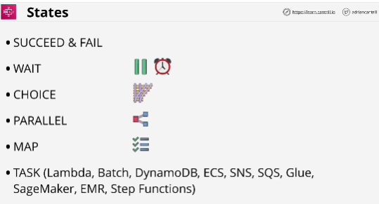
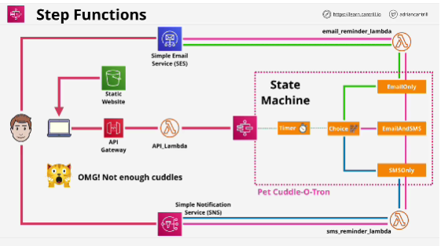

- **Step functions** is a product which lets you build long running serverless workflow based applications within AWS which integrate with many AWS services.

- **Never** do with Lambda:
    - put a full application inside a Lambda function (15 minutes limitations)

- **Step functions lets you create State Machines**.

- **Standard** workflow is default and it has limitation of one year.

- State Machines are used for backend processing.

- **Choice** is a state which allows us the State Machine to take a different path depending on an input.

- **Parallel state** alows you to create parallel branches within a state machine.

- **Map state** accepts a list of things. (list of orders - for each item in that list, the Map state performs an action or a set of actions based on that particular item)

- **Task state** represents a single unit of work performed by a State machine.

- Step functions let you create State Machines. 
- State Machines are long-running serverless workflows. 
- They have a start and end and in between they have States.
- States can be directional decision points or they can be tasks which actually perform things on behalf of the state machine. 