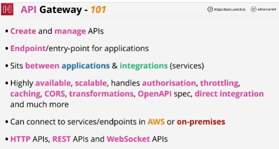
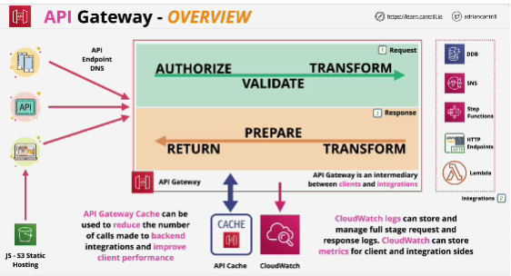
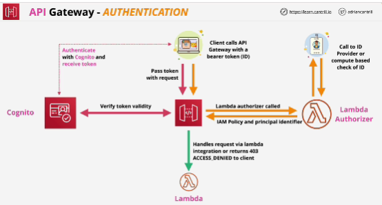
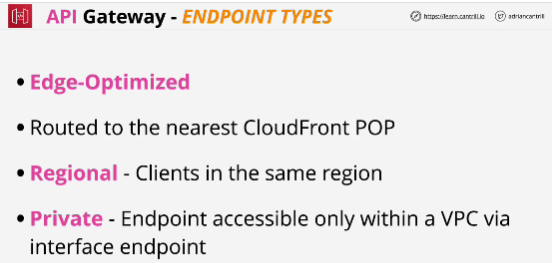
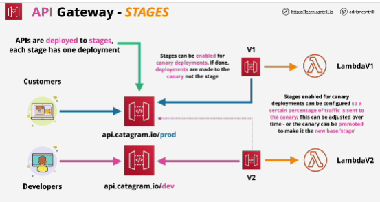
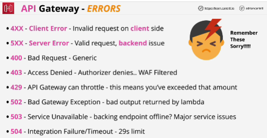
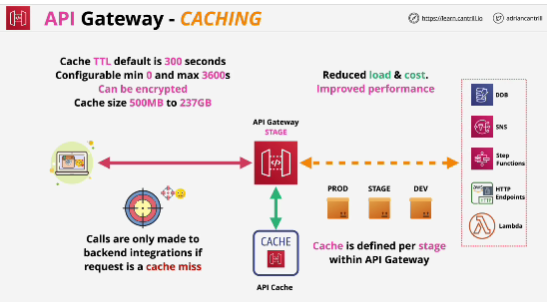

- API Gateway is a managed service from AWS which allows the creation of API Endpoints, Resources & Methods.

- The API gateway integrates with other AWS services - and can even access some without the need for dedicated compute.

- It serves as a core component of many serverless architectures using Lambda as event-driven and on-demand backing for methods.

- It can also connect to legacy monolithic applications and act as a stable API endpoint during an evolution from a monolith to microservices and potentially through to serverless.

- API gateway is capable of connecting to HTTP endpoints running in AWS or on premises.

- **Three phases** in most API gateway interactions:
1. **request phase**: where the client makes a request to the API gateway.
2. **response phase**
3. **CloudWatch** : store logging and metric based data for request and response side operations.

## Authentication
- API gateway can use **Cognito** user pools for authentication.
- Lambda based authorization (custom authorization): with this we assume that the client has some form of bearer token, something which asserts an identification and it passes this into API gateway with the request. 

- Lambda authorizer: job of this function is to validate the request.

## Endpoint types
- With **Edge-optimized** type any incoming requests are routed to the nearest CloudFront POP (point of presence)
- **Regional** doesn't use CloudFront.
- **Private**: how you can deploy private APIs.

- **Caching is configured per stage**. Cache can be encrypted.
Using a cache means that calls will only be made to the back end when there's a cache miss (reduce load, reduce cost, improved performance because of the lower latency that caching provides)

