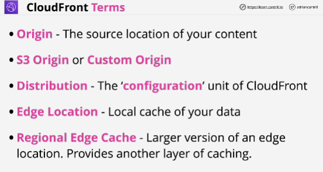
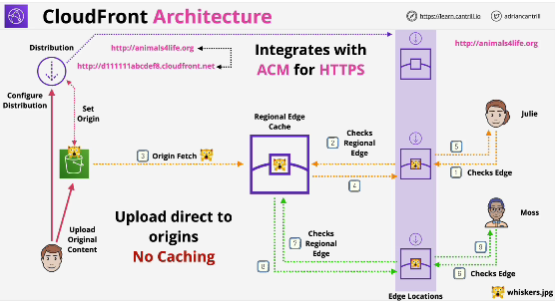
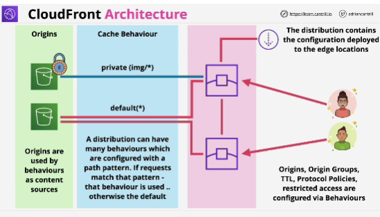

- **CloudFront** is a Content Delivery network (CDN) within AWS.
Its job is to imporove the delivery of content from its original location to the viewers of that data.

And it does so by caching and by using an efficient global network.

- **Origin** is where your content lives and it's where it's served from.

- **Distribution** is the unit of configuration within CloudFront. To use CloudFront, you create a distribution, and this distribution gets deployed out to the CloudFront network. 

- **Edge location**: names of the pieces of global infrastructure where your content is cached. 
Edge locations are used for the storage or the caching of data for CloudFront. 
You can't use them for deploying EC2 instances for example.

- **Regional Edge Cache**: there are fewer of them; they're designed to hold more data to cache things which are accessed less frequently.

- If the object is not stored locally in an edge location, this is called **cache miss**.

- If the object is not in the regional edge cache, the proccess that happens next is called an **origin fetch**.

- CloudFront **integrates with ACM** (AWS Certificate Manager) so you can use SSL certificates with CloudFront.

- CloudFront is for download-style operations only. 
CloudFront performs no write caching. 

- A behaviour is a configuration within a distribution. 
behaviours architecturally sit in the middle between origins and distributions. 

- A ClouFront distribution always has at least one behavior but it can have many more. 

