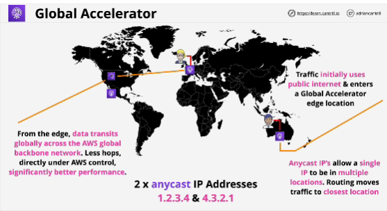
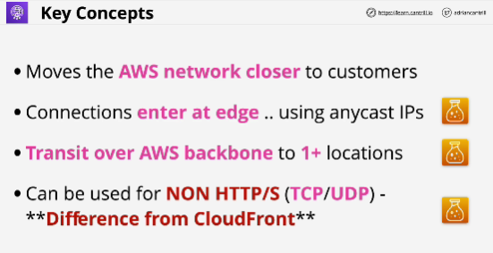

- **AWS Global Accelerator** is designed to improve global network performance by offering entry point onto the global AWS transit network as close to customers as possible using Anycast IP addresses.

- Global Accelerator starts with **two** Anycast IP addresses. (special type of IP address)

- We create Global Accelerator, we allocated two Anycast IP addresses, and if our customers use these, then their connections will be routed to the closest Global Accelerator edge location. 

- CloudFront movest the content closer by caching it on the edge locations. 
Global Accelerator moves the actual AS network as close to your customers as possible. 

- The aim with Global Accelerator is to get your customers onto the global AWS network as qucikly as possible, as close to their location as possible, and this is done using Anycast IP addresses. 

- Once the traffic arrives at the edge, it's transited over the AWS global network all the way through to one or more locations. 

- The key thing that Global Accelerator does is to get the data from your customer to an application endpoint as quickly as possible, with the best performance as possible. 

- **Global Accelerator** is a network product. (works on any TCP or UDP applications, including web apps, whereas CloudFront only caches HTTP and HTTPS content)

- **Caching, deal with web or secure web or anything involved with the delivery of content or the manipulation of that content -> CLOUDFRONT**, **TCP, UDP -> GLOBAL ACCELERATOR**

- **Global Accelerator doesn't cache anything, doesn't cache content, doesn't cache any network data and it doesn't understand the protcol for neither HTTP or HTTPS.** 

