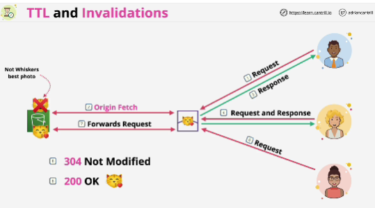
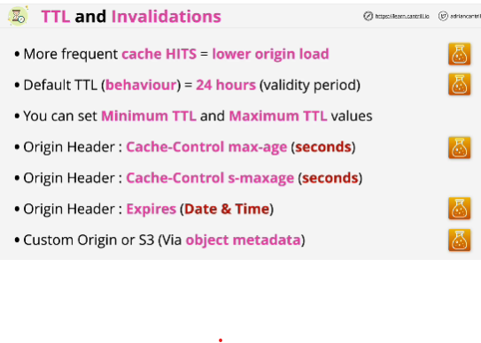
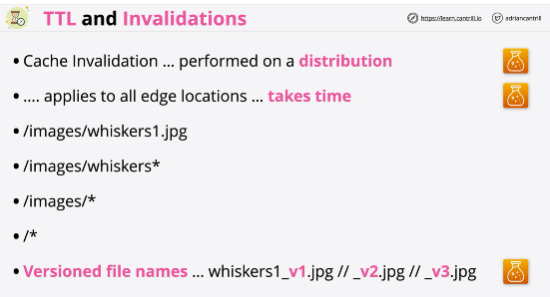

- Both can be used to influence how long objects are stored at edge locations and when they're ejected.

- Edge location views an object as not expired when it's within its TTL (time to live period).

- The more often the edge location delivers objects directly to your customer, the lower the load will be on your origin and the better performance for the user. 

- **Default TTL** 24 hours. You can change this value though but by default is 24 hours and this applies to any object which doesn't have a per object TTL set. 

- You also set **minimum TTL** and **maximum TTL values** and these act as limiters for any per object settings that are defined using these cache control headers. 

- Headers can be set using **custom origins or S3.**

- **Cache invalidation** immediately expire any objects regardless of their TTL based on the invalidation pattern that you specify.
Cost is the same regardless of the number of objects which are mathced by the pattern.

- **Versioned file names** are better for a few reasons:
    - you're using a different name for the object it means that even if those objects are cached in a customer's browser it won't be used because you+re changing the name and the application points at the new name even data cached in a user's browser won't impact the image or the object that your customers see;
    - logging is more effective because you know which actual object was used because nothing has the same name;
    - you keep all versions of all objects and these are consistent between edge locations so you can move between them and it's less expensive because you don't need to use continued cache invalidations;

- S3 object versioning allows you to have different data for an object, different versions which use the same name.
CloudFront will always use the latest object version in a bucket by default. 

- Using versioned file names means having different file names for different actual versions, different data stored in different file names, each of these file names will be cached independently on every edge location and you can move between them in a consistent way by making changes to your application.

## EXAM
Scenario: cost efficacy point of view then it's likely going to be **versioned file names** which is the correct answer.