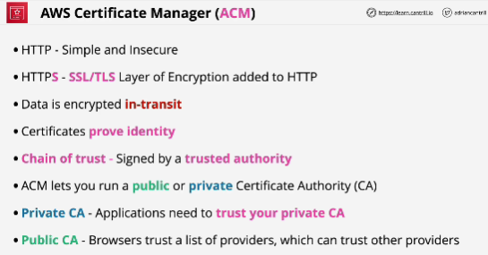
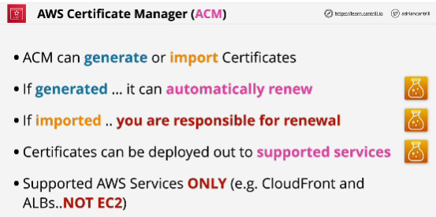
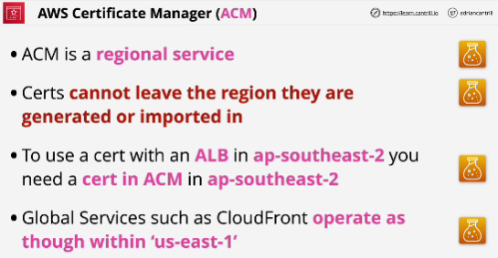
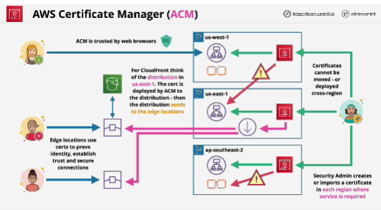

- **ACM** cannot be used with EC2.

- **To use certificate from ACM inside a load balancer within a particular region - ap-southeast-2, that Certificate needs to be within ACM also in ap-southeast-2.**

- For most services the Certificate needs to be in the same region where the service is located. So a load balancer needs to be in the same region as the Certificate that it's using within ACM. 

- For **CloudFront**, always use **us-east-1** with ACM.
If you generate a Certificate in any other region, you won't be able to deploy it using CloudFront.

- Cross region deployment is not supported.

