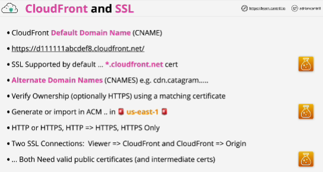
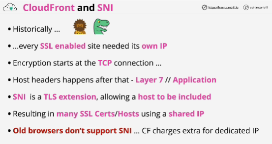
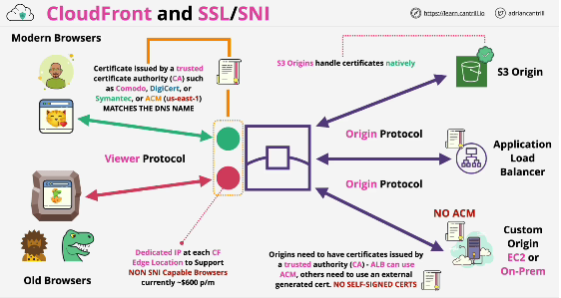

- Each CloudFront distribution receives a default domain name when it's created.

- If you use HTTPS, you need a certificate applied to the distribution which matches that name.

- Self-signed certificates, will not work with CloudFront.

- **SNI** Server Name Indication adds the ability for a client to tell a server which domain name it's attempting to access. 

- When using CloudFront, you can either choose to use SNI mode, which is free as part of the service, or you can choose to use a dedicated IP at the edge location, and this costs money.

- **Viewer protocol/viewer connection** is connection between the viewers or the customers and the edge location. 

The certificate used by the edge location has to be a publicly trusted certificate.

- **Only publicly trusted certificates are able to be applied to CloudFront distributions.**

- Connection between the edge location and the origin or the origins: **origin protocol**
If you're using an application load balancer, then this needs a publicly trusted certificate and you can either use one that's generated externally or you can use the AWS certificate manager to generate and manage one on your behalf. 

For any custom origins (EC2), you need to use a publicly trusted certificate, but neither of these services are supported by ACM. You can't use ACM to manage the certificate on your behalf.
You need to apply the certificates manually.

In all cases for origins, the certificate needs to match the DNS name of the origin. 
