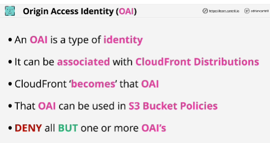
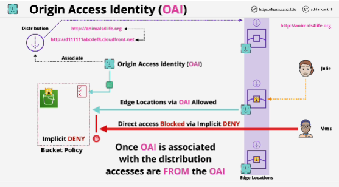
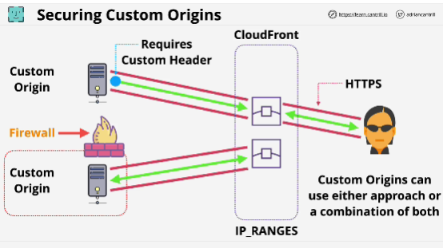

- You can use S3 as an origin for CloudFront, but you can do it in two different ways:
1. If you use S3 as an origin, that's known as an S3 origin
2. If you utilize the static web hosting feature of S3 and use this with CloudFront, then the S3 bucket is treated the same as any non-S3 origin (custom origin)

- **Origin Access Identity (OAI)** is only applicable for S3 origins, so not using the static website feature of S3.

- For custom origins, we have two ways that we can implement a more secure architecture:
1. utilize custom headers (users use HTTPS to communicate with the edge locations); if header isn't present, the origin will simply refuse to service any of the requests
2. via traditional security methods (the origin is essentially private to anything but CloudFront and can't be bypassed)

