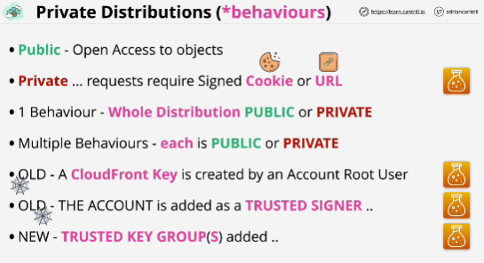
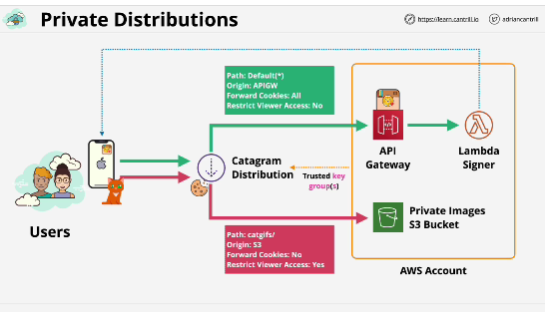

- Two ways to configure private behaviors in CloudFront:

1. old way (you first need to create a CloudFront key to use and this is something that an account route user had to create and manage) **trusted signer**

2. preferred way (create **trusted key groups** and assign those as signers; the key groups determine which keys can be used to create signed URLs and signed cookies)

In both cases you require a signer and signer is an entity or entities which can create signed URLs or signed cookies.

- Once a signer is added to a behavior, that behavior is now private and only signed URLs and cookies can be used to access content.

