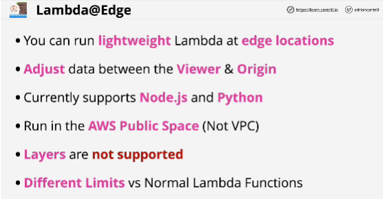
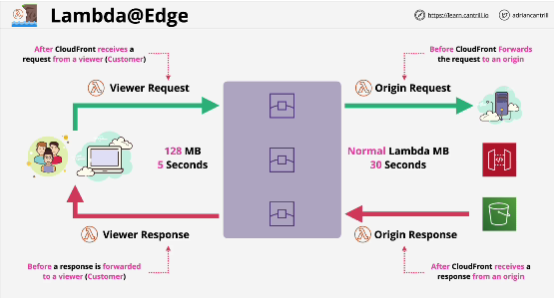
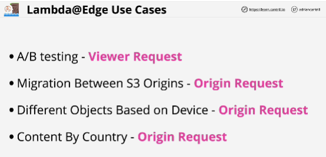

Any interaction between a customer, edge location, and origin consists of four individual parts of that communications:

1. the connection between the customer and the edge location (Viewer Request)

2. connection between the edge location and the origin (Origin Request)

3. when origin responds, there's a connection between the origin and the CloudFront edge (Origin Response)

4. connection between the edge location and the customer (Viewer Response)

