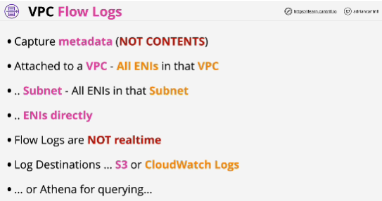
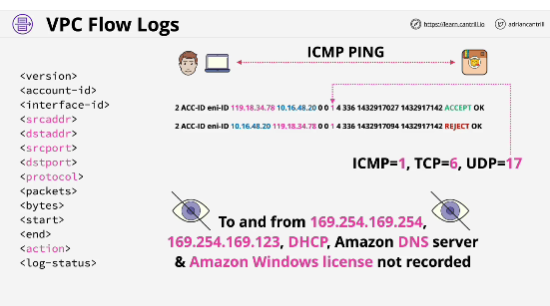

- VPC Flow logs is a feature allowing the monitoring of traffic flow to and from interfaces within a VPC

- VPC Flow logs can be added at a VPC, Subnet or Interface level.

- If you need to capture the contents of packets then you need a packet sniffer, something which you might install on an EC2 instance.

- VPC only capture metadata (source IP, destination IP, source and destination ports, packet size..)

- Flow logs work by attaching virtual monitors within a VPC and these can be applied at three different levels:

1. **VPC level**: monitors every network interface in every subnet within that VPC

2. **Subnet level**: monitors every interface within that specific subnet and they can be applied to interfaces directly and only monitor that one specific network interface.

- **You can't rely on flow logs to provide real-time telemtry on network packet flow.**

- If you use S3 you're able to access the log files directly and can integrate that with either a third-party monitoring solution or something that you design yourself 

- If you use CloudWatch logs then you can integrate that with other products, you can stream that data into different locations and you can access it either programmatically or using the CloudWatch logs console.

- **Flow logs** captures what are known as **Flow log records**

- A VPC Flow Log is a collection of rows and each row has the fields. 

- VPC Flow Logs don't log all types of traffic (don't include metadata, server request, DHCP request which are running inside the VPC)

