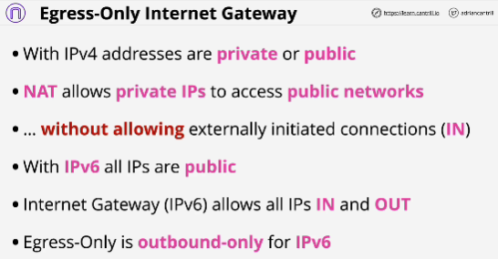
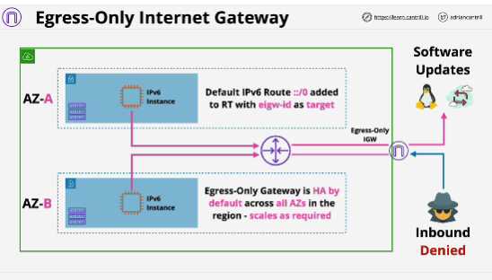

- **Egress-Only internet gateways** allow outbound (and response) only access to the public AWS services and Public Internet for IPv6 enabled instances or other VPC based services.

- NAT doesn't allow any connections from the internet to be initiated to the private instance. 
NAT as a process allows private EC2 instances to connect out to the public internet and receive responses back, but doesn't allow the public internet to connect into that private instance.

- NAT doesn't work with IPv6.

- Architecture of Egress-Only internet gateways is the same as a normal internet gateway.

- Egress-Only internet gateways doesn't allow incoming connections.

