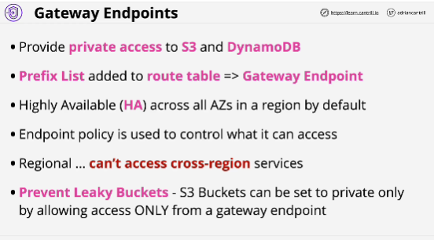
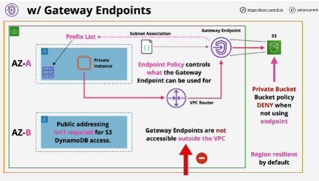

- **Gateway endpoints** are a type of VPC endpoint which allow access to S3 and DynamoDB without using public addressing.

- Private access: private-only resource inside a VPC or any resource inside a private-only VPC to access S3 and DynamoDB.

- Prefix list: object, logical entity which represents services (S3 or DynamoDB).

- **Gateway endpoint does not go into a particular subnet or an AZ, it's highly available acrosss all AZs in a region by default.**

- A Gateway endpoint is a VPC gateway object. It is highly available, it doesn't go in particular subnet.

- Gateway endpoint can be used to access services in the same region.

- Gateway endpoint support two main use cases:
1. you might have a private VPC and you want to allow that private VPC to access public resources.
2. idea of private-only S3 buckets

- Gateway endpoint are only accessible inside specific VPC.

- Endpoint policies can be used on gateway endpoints to control what the endpoint can be used to access.

