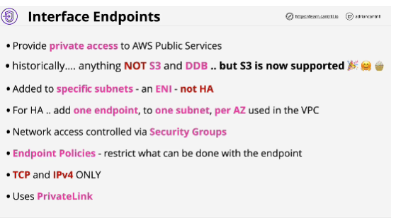
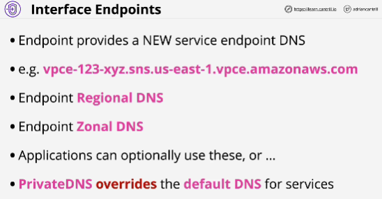
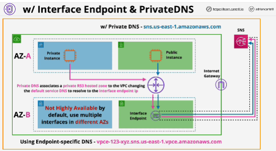

- **Interface endpoints** are used to allow private IP addressing to access public AWS services.

- S3 and DynamoDB are handled by gateway endpoints - other supported services are handled by interface endpoints.

- Unlike gateway endpoints - interface endpoints are not highly available by default - they are normal VPC network interfaces and should be placed 1 per AZ to ensure full HA.

- Interface edpoints use **PrivateLink** which is a product that allows external services to be injected into you VPC, either from AWS or from third parties.

PrivateLink is how interface endpoints operate, but it's also how you can deploy third-party applications or services directtly into your VPC.

- Interface endpoints used a prefix list which was logical representation of a service and this was added to route tables.

- **Private DNS** associate a route 53 private hosted zone with your VPC.
Your application can use interface endpoints without being modified.

- Interface endpoint uses DNS and a private IP address for the interface endpoint. 

- Interface endpoint don't use routing, they use DNS.

- If you're utilizing multiple AZs, then you need to put interface endpoints in every AZ that you can use inside that VPC.

