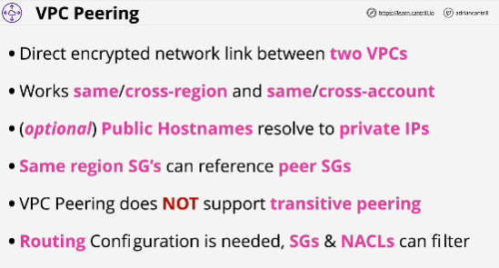
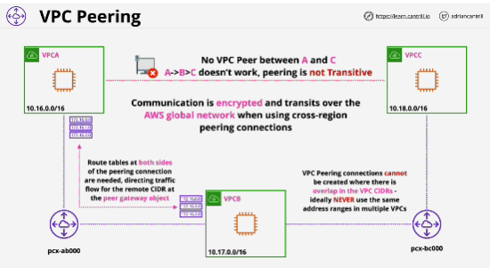

- **VPC Peering** lets you create a private and encrypted network link between two VPCs.

- One peering connection links two, and only two, VPCs.

- In different regions, you can still utilize security groups, but you'll need to reference IP addresses or IP ranges.

- If the VPC peers are in the same region, than you can do the logical referencing of an entire security group.

- This connection is not transitive: if VPC A peered to VPC B, and you have VPC B peered to VPC C, that does not mean that there is a connection between A and C.

- When you create a VPC peering connection between two VPCs, you're actually creating a logical gateway object inside of both of those VPCs.

## EXAM
- IP address ranges of the VPCs, VPC CIDRs cannot overlap if you want to create VPC peering connections.

