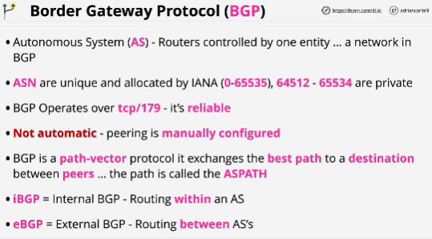
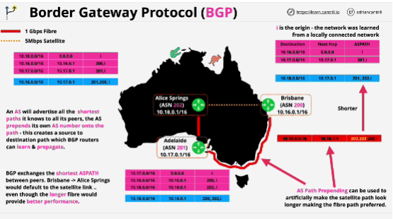

- **BGP** is a routing protocol (protocol which is used to control how data flows from point A through point B and C, and arrives at the destination point D)

- Border Gateway Protocol (BGP) is used by some AWS services such as Direct Connect and Dynamic Site to Site VPNs.

- ASN (Autonomous system Numbers) are the way that BGP identifies different entities within the network, different peers.

- BGP is designed to exchange network topology.

- Autonomous system advertise the shortest route that they're aware of to any other Autonomous systems that they have peering relationships with.

- By default BGP always uses the shorter path as the preferred one.

- BGP decides everything on path length.

