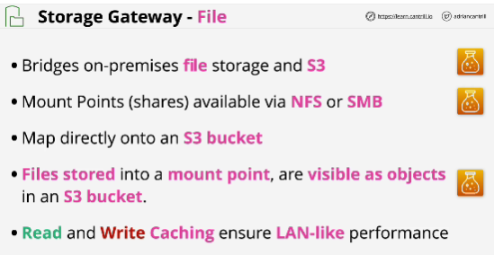
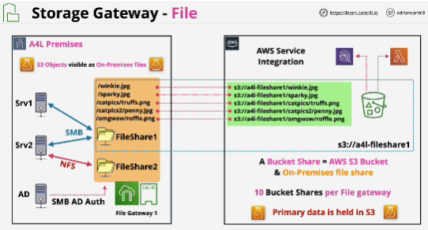
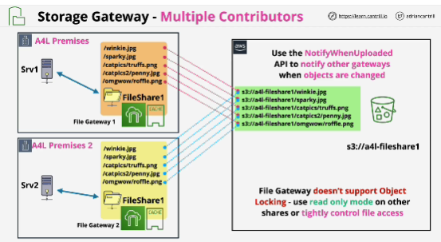
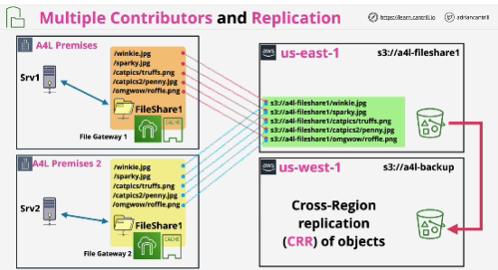
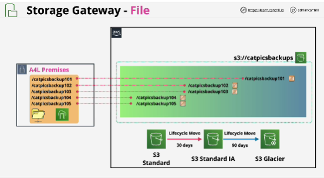

- With file gateway, you create one or more **Mount Points** or shares, and these are available via two protocols: **NFS** (used for Linux servers and workstations) and **SMB** (Windows network file-sharing protocol)

- File shares and the buckets are linked together.

- File gateway doesn't support any form of object locking.

