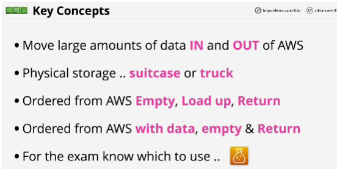
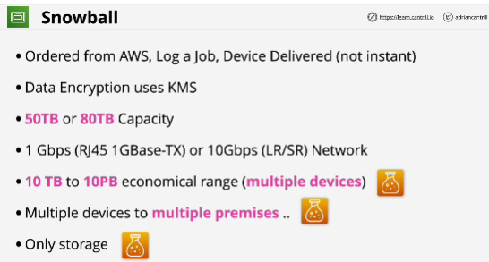
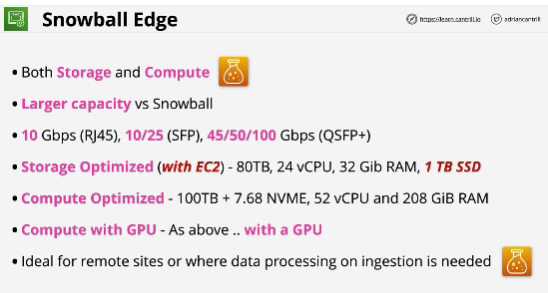
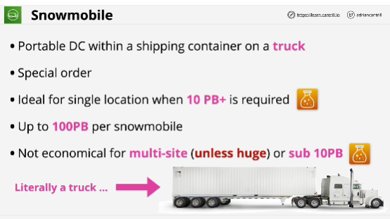

- **Snowball, Snowball Edge and Snowmobile** are three parts of the same product family designed to allow the physical transfer of data between business locations and AWS.

## Snowball
- When you're using the Snowball product, it's a physical process. You're physically interacting with AWS.

- Benefit using Snowball: you can order multiple devices

- Only inludes storage, it's only storage device. It doesn't include any compute capability

## Snowball Edge
- Comes with both storage and compute

## Snowmobile
- It's not something that's available in high volume and it's not available everywhere.

- It's generally used when you have single location with huge amounts of data that you need to ingest into AWS.

- It's a single truck.

