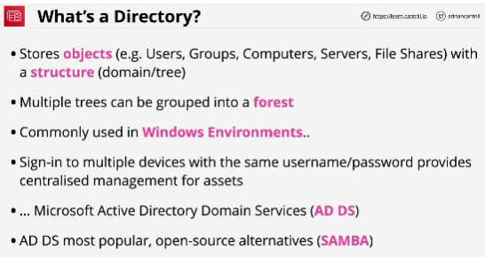
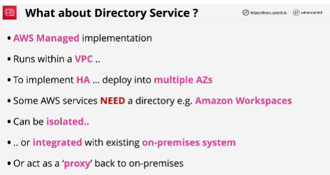
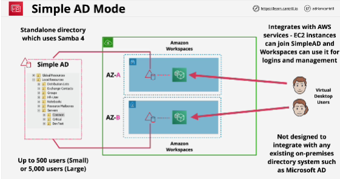
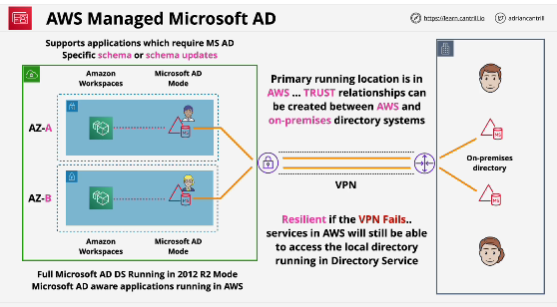
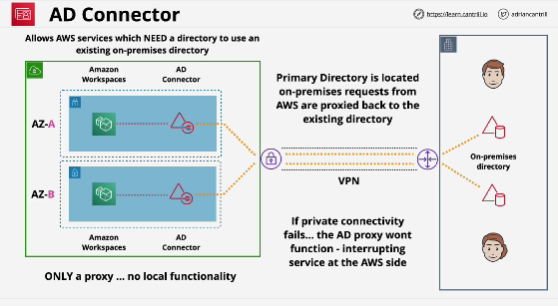
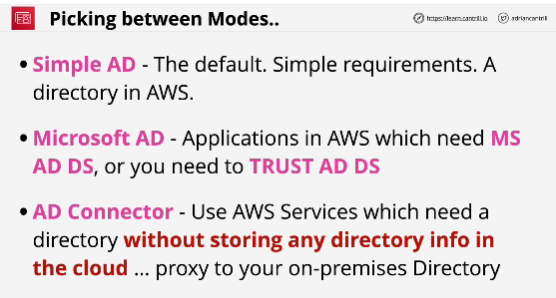

- You can join devices to a directory.

## Simple AD Mode
- Cheapest and the simplest way that the product can run inside a VPC.

- Workspaces as a product requires a directory service.

- Simple AD is an open source directory that's based on Samba 4.

- It's designed to be used in isolation. It's not designed to integrate with on-premises systems and it isn't a full implementation of something like Microsoft Active Directory.

## Managed Microsoft AD Mode
- Designed when you want to have a direct presence inside AWS, but also when you have an existing on-premises environment.

- Benefit: primary location is in AWS and it trusts your on-premises directory.
It the VPN fails, the AWS services which rely on the directory will still be able to function.

## AD Connector
- It is only a proxy.

- It just exists as an entity to integrate with AWS services.

- It doesn't provide functionallity of its own. You create it, you have to point it back at your on-premises environment and it requires connectivity to your on-premises environment and for that on-premises environment to be fully functional. 

