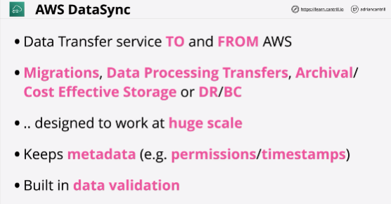
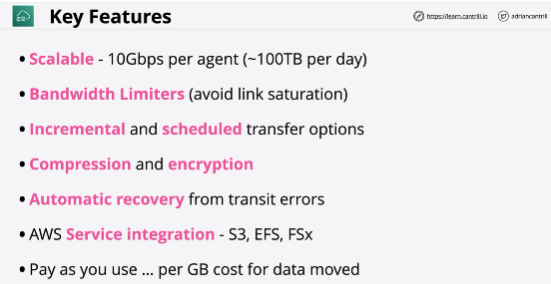
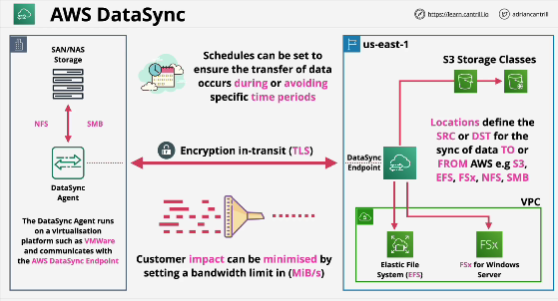
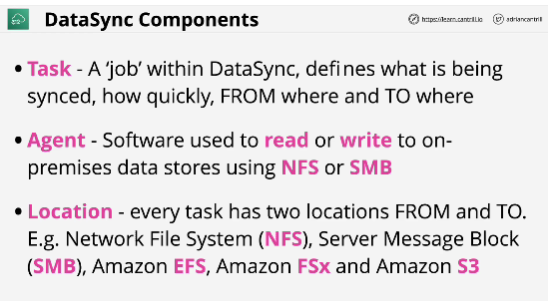

- **AWS DataSync** is a product which can orchestrate the movement of large scale data (amounts or files) from on-premises NAS/SAN into AWS or vice-versa.

- You need to have the DataSync agent installed locally within your on-premises environment.

- It communicates over NFS or SMB with on-premises storage, and then it transfers that data through to AWS.

- It can recover from failures, it can use schedules, it can throttle the bandwith between on-premises and AWS.

## EXAM
- Questions talk about the reliable transfer of large quantities of data, it it needs to integrate with EFS, if it needs to integrate with FSx, if it needs to integrate with S3 and support bidirectional transfer, incremental transfer, schedule transfer - **DataSync** right answer

- Using electronic method: Snowball or Snowball Edge aren't appropriate.

- If you need something that can transfer data in an out of AWS, if that product needs to support schedules, automatic retries, compression, and cope with huge scale transfers involving lots of different AWS and traditional file transfer protocols - **DataSync**

