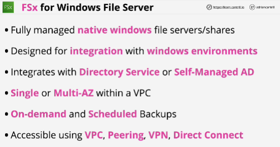
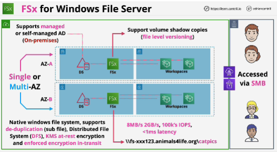
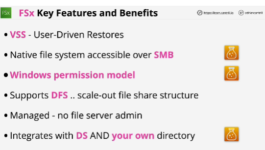

- **FSx** is a shared file system product.

- It's a resilient and highly available system and it can be deployed in either single or multi-AZ mode.

- It is a Native Windows file system.

## EXAM
- Windows-related keywords: native Windows file systems, Active Directory or directory service integration - **FSx**

- Shared file systems for Linux EC2 instances, Linux on-premises servers - **EFS**

- VSS: Window feature that allows users to perform file and folder level restores. Unique to FSx and it means that if you have any users of Workspaces, if they use files and filders on an FSx share, and they right-click, they can view previous versions.

- EFS file system uses the NFS protocol. 

- DFS: distributed file system -> FSx

