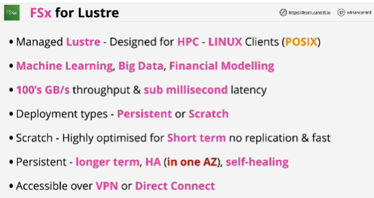
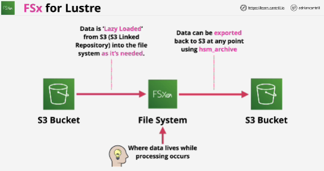
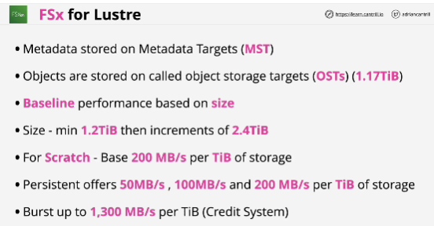
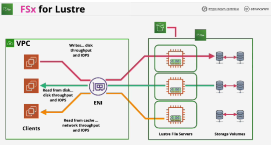
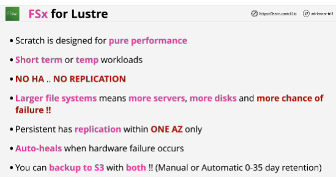

- Designed for various high performance computing workloads.

- It supports Linux-based instances running in AWS, and it supports POSIX style permissions for file systems.

- It's accessible from within a VPC and anything connected to that VPC via private networking.

- File system is where the data lives.

- ENI: Elastic Network Interface

- Lustre runs from one AZ.

- If an entire AZ fails, then you could have data loss because hardware is not recoverable outside of that AZ.

