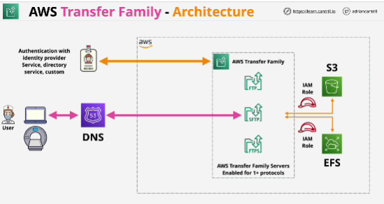
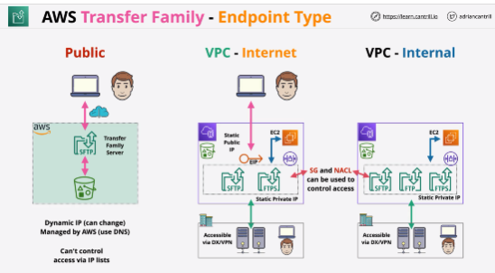
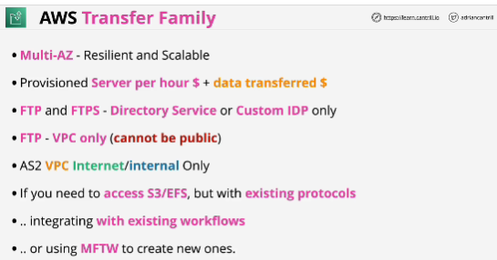

- **AWS Transfer Family** is a secure transfer service that enables you to transfer files into and out of AWS storage services.

- AWS Transfer Family supports transferring data from or to the following AWS storage services.

Amazon Simple Storage Service (Amazon S3) storage.
Amazon Elastic File System (Amazon EFS) Network File System (NFS) file systems.

- AWS Transfer Family supports transferring data over the following protocols:

Secure Shell (SSH) File Transfer Protocol (SFTP)
File Transfer Protocol Secure (FTPS)
File Transfer Protocol (FTP)
Applicability Statement 2 (AS2)

## AWS Transfer Family - Endpoint Type
- Within Transfer Family, you create servers, which you can think of as the front-end access points to your storage.

- Three different options:

1. public: endpoint is running in the AWS public zone, and it's accessible from the public internet; 
- you don't need to configure anything in the way of networking or have to worry about VPCs or any other networking components
- only supported protocol is SFTP
- endpoint has a dynamic IP which can change, and this is managed by AWS 
- you can't control who can access it using features such as network access control lists or security groups

2. VPC - Internet: run inside a VPC;
- you can use SFTP and FTPS endpoints 
- AS2 endpoint
- Transfer Family provides static IPs
- secured using access control lists or security groups
- allocated with an Elastic IP, allows it to be accessible over the public internet in adition to within the VPC and from corporate networks

3. VPC - Internal: run inside a VPC;
- you can use SFTP, FTPS and FTP endpoints in addition to AS2
- Transfer Family provides static IPs
- secured using access control lists or security groups

