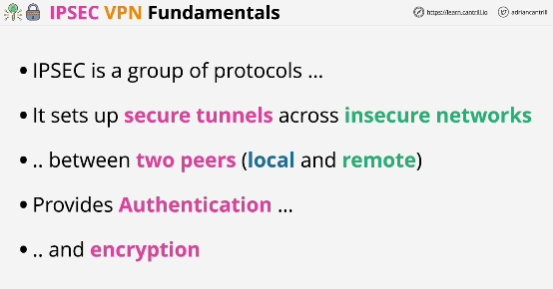
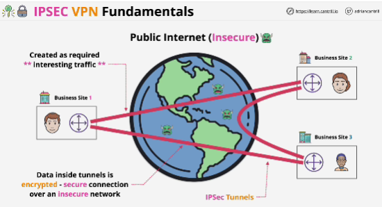
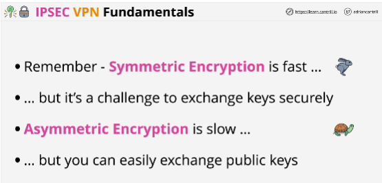
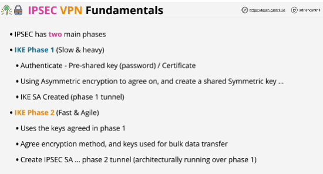
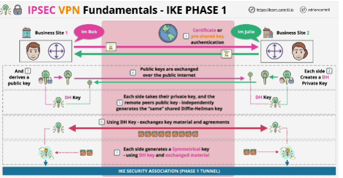
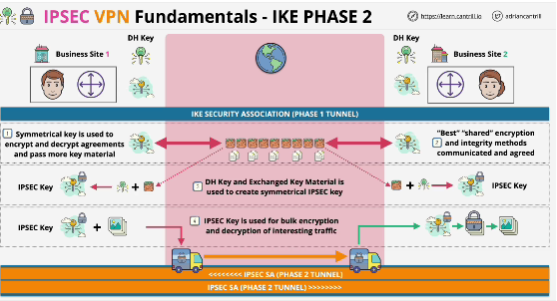
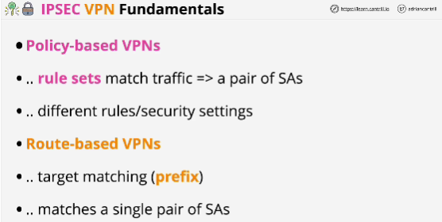
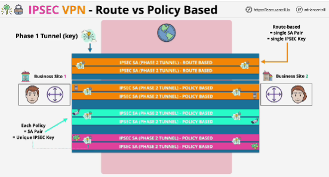

- **Interesting traffic** is simply traffic which matches certain rules.
Regardless of the rules, if data matches any of those rules it's classified as interesting traffic and a VPN tunnel is created to carry traffic through to its destination.

If there's no interesting traffic then the tunnels are turn down only to be reestablished when the system next detects interesting traffic.

- Any data within tunnels is encrypted while transiting over that insecure network, it's protected.

-IPsec VPN negotiation occurs in two phases. In **Phase 1**, participants establish a secure channel in which to negotiate the IPsec security association (SA). In **Phase 2**, participants negotiate the IPsec SA for authenticating traffic that will flow through the tunnel.

- IKE (Internet Key Exchange) Phase 1: slow and heavy; protocol for how keys are excahanged

- IKE Phase 2: fast and agile; 

- Diffie-Hellman private key is used to decrypt data and to sign things.

- **Two** different types of VPN:

1. Policy-based VPNs: there are rules created which match traffic; you can have different rules for different types of traffic

2. Route-based VPNs: target matching based on prefix; with this type you have a single pair of security associations for each network prefix; all traffic types between those networks use the same pair of security associations 

- Policy-based VPNs are more difficult to configure but do provide more flexibility when it comes to using different security settings for different types of traffic.

