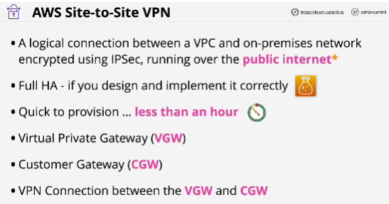
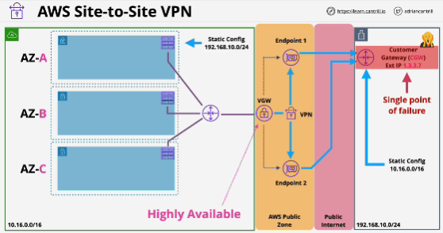
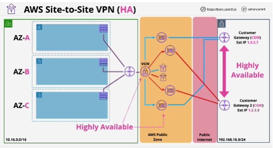
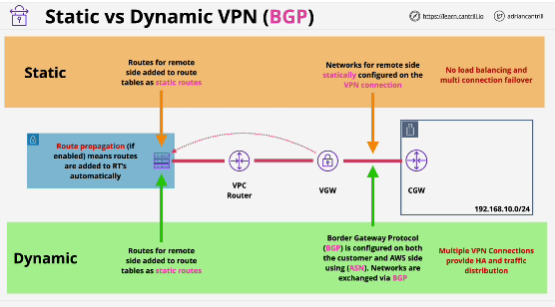
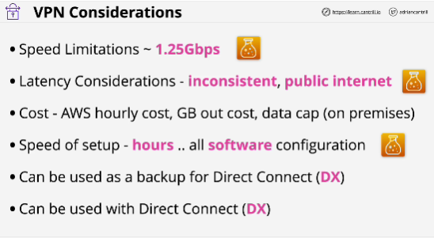

- **AWS Site-to-Site VPN** is a hardware VPN solution which creates a highly available IPSEC VPN between an AWS VPN and external network such as on-premises traditional networks. VPNs are quick to setup vs direct connect, don't offer the same high performance, but do encrypt data in transit. 

- Customer Gateway (CGW): it's often used to refer to both the logical piece of configuration within AWS and the thing that configuration represents, a physical on-premises router which the VPN connects to.

- Step one for creating a VPN connection: gather all of the required information; we need the IP address range of the VPC that will be connecting to the on-premises network and IP range of the on-premises network itself and the IP address of the physical router on the customer premises. 

- Virtual private gateway is a highly available gateway object and it has physical endpoints.

- second step: create a VPN connection inside AWS (you need to link it to a virtual private gateway) and specify a custom gateway to use

- If customer on-premises router fails, then the whole VPN connection fails.

- Dynamic VPN uses a protocol BGP, static VPN uses static networking configuration

- If you need speed more than 1.25 GBps, then you can't use VPNs.

