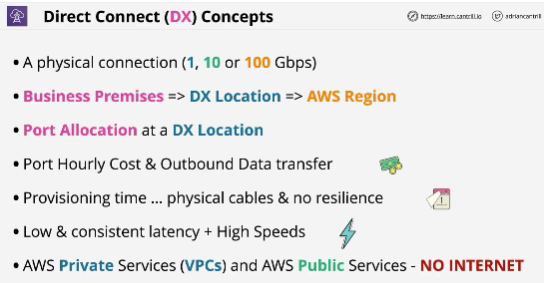
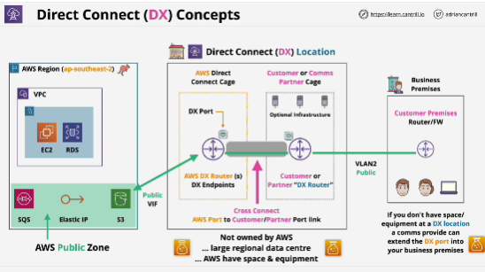

- **AWS Direct Connect** links your internal network to an AWS Direct Connect location over a standard Ethernet fiber-optic cable. One end of the cable is connected to your router, the other to an AWS Direct Connect router.

- With this connection, you can create virtual interfaces directly to public AWS services (for example, to Amazon S3) or to Amazon VPC, bypassing internet service providers in your network path. An AWS Direct Connect location provides access to AWS in the Region with which it is associated. You can use a single connection in a public Region or AWS GovCloud (US) to access public AWS services in all other public Regions.

- Inbound data transfer is free of charge.

- Provisioning time: AWS will take time to allocate a port and then once allocated, you will need to arrange connection into that port at the DX location.

- Direct connect cannot be used to access the public internet unless you add a proxy or other networking appliance to do that on your behalf.

- Customer cage: Rent space DX location

- Direct connect is a port allocation.

- Cross connect: connection between the Direct Connect port within the AWS cage, in the DX location, and either a port on your router or a communication partner router also within DX location.

- We have to configure virtual interfaces over the single physical connection -> VIFs

