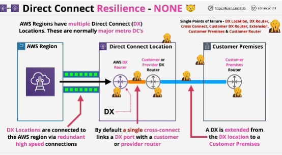
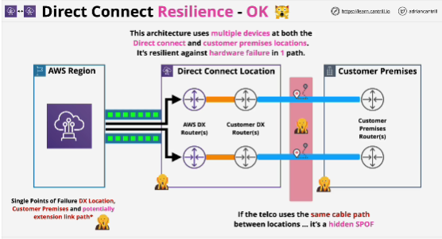
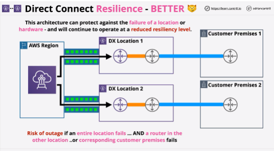
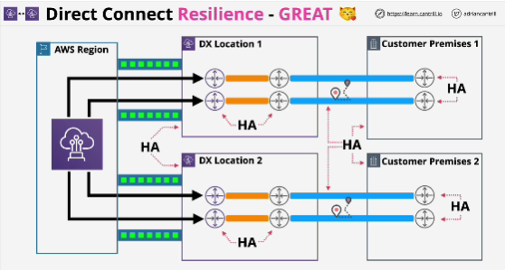

- AWS region is linked in a highly available way to one or more DX locations. 
The DX locations houses the AWS DX routers in addition to your or a provider's DX router and you cross connect from the AWS DX router into your DX router with a physical cable.

Problems with previous architecture:
- enitre DX location could fail
- AWS DX router could fail eihter in isolation or along with the building
- cross connect: cables fail
- DX router could fail
- failure of actual customer premises environment or your customer premises router within that environment could also have a hardware failure

- Direct connect is not resilient in any way by default.
It's a product which is based on lots of physical components, which each depend on each other, but it's also a product that's designed to be flexible.

- We can improve the resilience of the architecture by provisioning multiple DX ports.

- If you have multiple routers in the DX location, you can configure multiple cross connects into multiple DX ports.
And from there, you can extend those into ultiple customer premises routers using extensions.

- If the DX location itself fails, then connectivity is lost.
If single customer location fails then the connectivity to the AWS platform is also lost.

- Direct connect is a physical technology and it is not resilient in any way unless you architect it that way.

