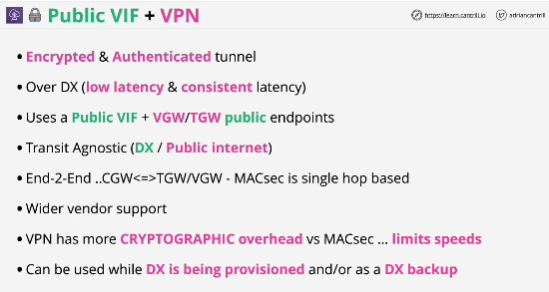
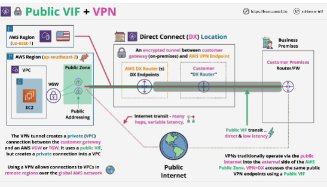

- VPN is great because it's transit agnostic: you can connect using a VPN to Virtual Private Gateway or a Transit Gateway over the public internet or over a Public VIF.

- **MACsec** is connection between two hops in the same layer 2 local area network.

- IPsec running over a Direct Connect, it doesn't compete with MACsec.

- VPN is when you need end-to-end encryption of data from AWS to On-premises networks

