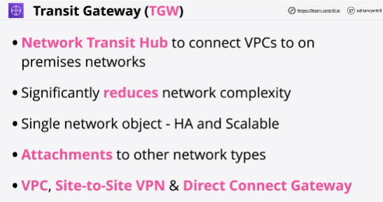
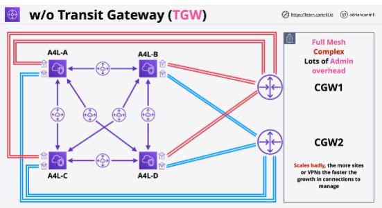
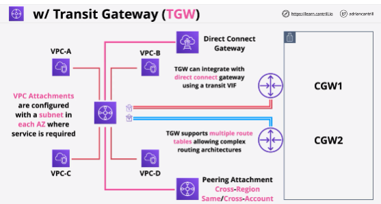
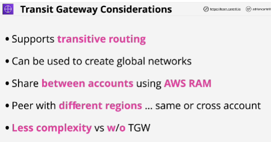

- **The AWS Transit gateway** is a network gateway which can be used to significantly simplify networking between VPC's, VPN and Direct Connect.

- It can be used to peer VPCs in the same account, different account, same or different region and supports transitive routing between networks.

- Transit gateways come with a default route table which is how traffic is routed between attachments, but you can create a complex routing topology by using multiple route tables.

- **You can peer transit gateways with different regions in the same or cross accounts. It doesn't have any limitations in terms of region or accounts.**

