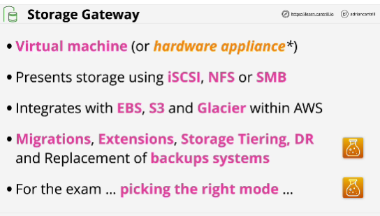
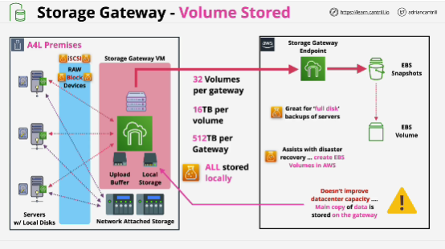
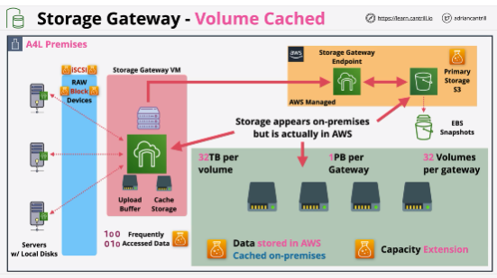

- **Storage gateway** is a product which integrates local infrastructure and AWS storage such as S3, EBS Snapshots and Glacier.

- Volume gateway works in two different modes:

1. **cached mode**: main location for the data is no longer on premises, instead the primary location for data is in AWS, specifically S3;

2. **stored mode**: virtual appliance presents volumes over iSCSI to servers running on premises, just like the NAS or SAN hardware; all the primary data is stored locally on the gateway

When you're using Storage Gateway in volume stored mode, everything is stored locally.
All of the volumes presented to servers are stored on local storage on premises.

Seperate area of storage called the **upload buffer** 

**This mode doesn't allow extending your data center capacity because the primary location for data using this mode of Storage Gateway is on premises.**

Volume Gateway deals in volumes.

## EXAM
If you're dealing with volumes and you need something to improve capacity at an on-premises or data center location, then this mode (volume stored) is not the mode to help you with.

If you need to keep low-latency access to data, this mode works because the primary location of that data is on premises.

If you need help with full-disk backups or disaster recovery, this method is potentially ideal

- Both of the modes work with volumes which are raw block storage.
- Difference: volume stored mode stores everything on premises and essentially, uses AWS just for backups.