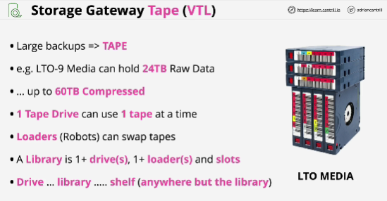
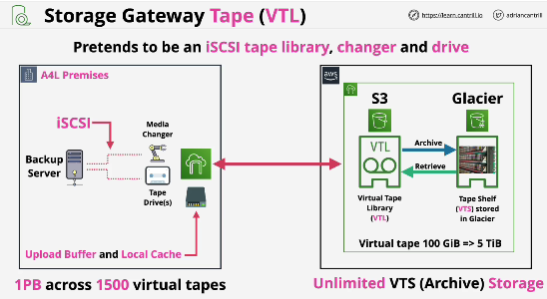

- Storage gateway in VTL mode allows the product to replace a tape based backup solution with one which uses S3 and Glacier rather than physical tape media

- VPL: Virtual Tape Library

- Glacier Deep Archive is used for lonfer term data retention where you might never need to access the data again, but you need to keep it, maybe for legal reasons.

