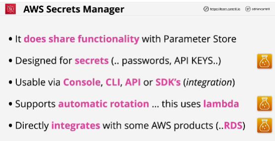
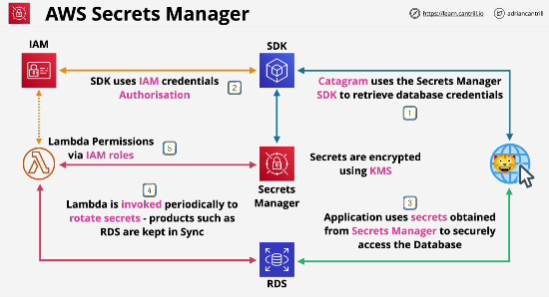

- **AWS Secrets manager** is a product which can manage secrets within AWS. There is some overlap between it and the SSM Parameter Store - but Secrets manager is specialised for secrets.

- **Secret manager** is designed specially for secrets, things like passwords and API keys. 

- Rotating secrets with RDS, secrets, product integration -> Secret manager

- Hierarchical configuration information, configuration for the CloudWatch agent -> Parameter Store

- Secrets are secured using KMS so you never risk any leakage via physical access to the AWS hardware, and KMS also ensures role seperation, which means that you need permissions both to KMS and to Secrets Manager in order to access secrets and decrypt them. 

