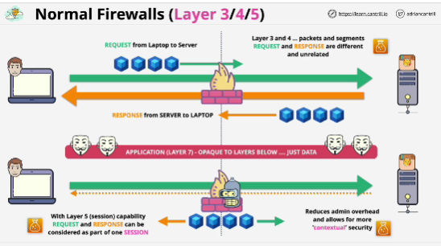
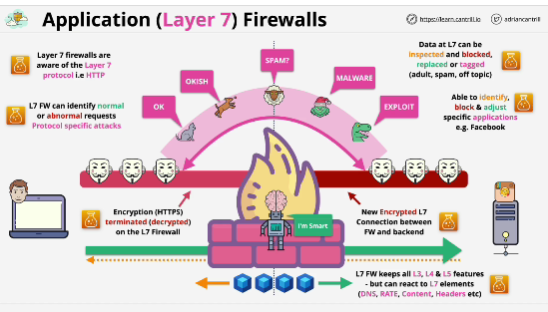

## Firewalls Layer 3/4/5
- The firewall understands that the request and the response are part of the same session.

- Firewall don't understand anything above the layer which they operate.

- Firewall have no visibility into layer seven - HTTP; can't see headers or any of the other data that's been transfered over HTTP.

## Layer 7 Firewall
- Layer 7 firewall keeps all of the layer three, four, and five features, but can react to layer seven elements.

- The limit is only based on what the firewall software supports.

