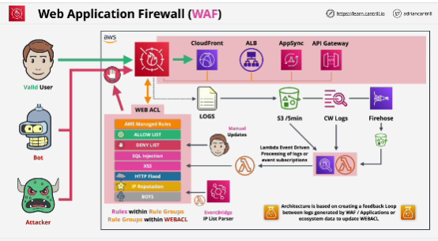
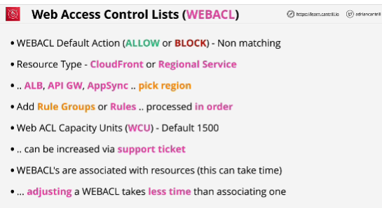
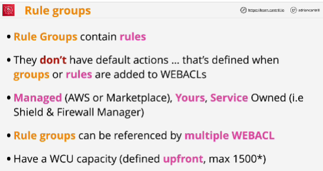
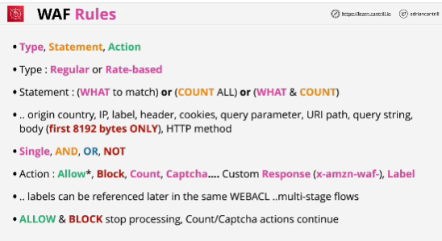
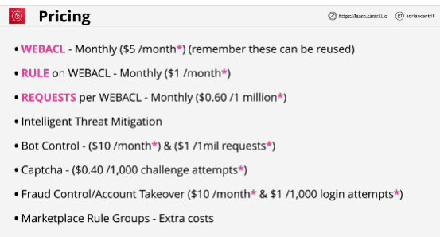

## WAF
- Implementation of a layer seven, or application layer firewall (firewall which is capable of understanding layer seven protocols such as HTTP and HTTPS)

- AWS WAF is a web application firewall that helps protect your web applications or APIs against common web exploits and bots that may affect availability, compromise security, or consume excessive resources.

- WAF is the product but the actual unit of configuration within the product is known as **web ACL** (web access control list)

- WAF can protect global services such as CloudFront but also regional resources such as Application Load Balancer, API Gateways and AppSync.

- WAF does output logs, and logging can be directed at S3 directly at CloudWatch Logs or Kinesis Firehose. 
If you want to react to logs quickly, you should't use S3 as these are delivered directly approximately every five minutes.

- web ACL have a limit of how much compute requirements rules contained within them can use. 

- Relationship is currently that a resource can have one web ACL but one web ACL can be associated with many resources.

- You can't associate a CloudFront web ACL with a regional resource or vice versa.

- With rate-based rules, you only have Block, Count and Captcha: you don't have allow.

