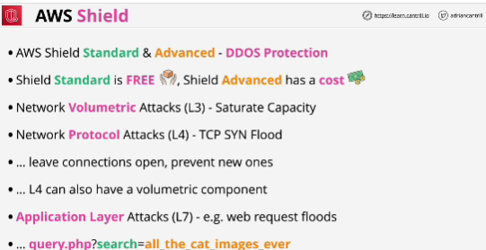
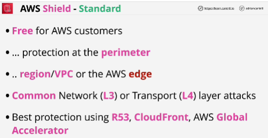
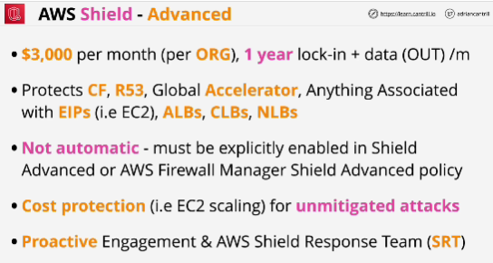
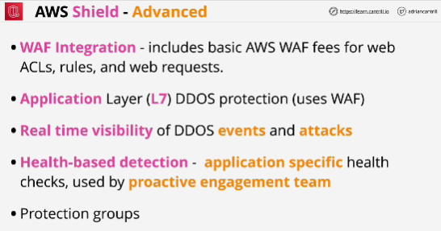

- **AWS Shield** is a managed Distributed Denial of Service (DDoS) protection service that safeguards applications running on AWS. AWS Shield provides always-on detection and automatic inline mitigations that minimize application downtime and latency, so there is no need to engage AWS Support to benefit from DDoS protection. 

