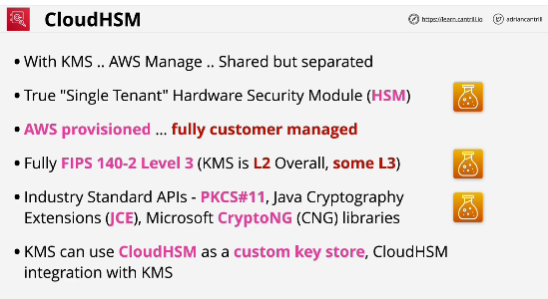
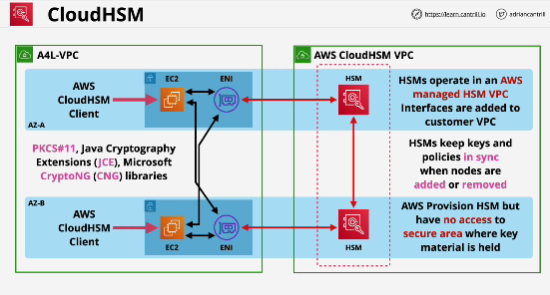
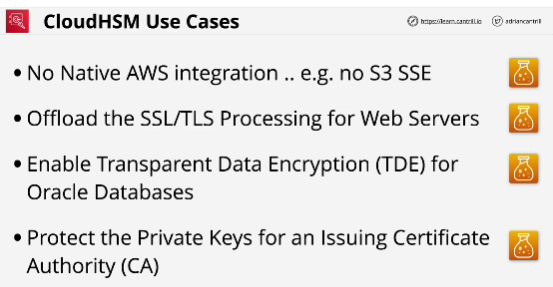

- Similar to KMS

- If you as the customer lose access to a HSM, game over.
You can reprovision them, but there is no easy way to recover data.

- With KMS all operations are performed with AWS standard APIs and all permisions are also controlled with IM permissions. 

- CloudHSM is deployed into an AWS managed cloud HSM VPC that you have no visibility of.

- To achieve High availability, you need to deploy multiple HSMs and configure them as a cluster.

- By default, HSM is not a HA device. It's a physical network device that runs within one AZ.

- In order to utilize CloudHSM devices, a client needs to be installed on the EC2 instances which are going to be configured to access the CloudHSM.

- While AWS do provision the HSM, they're actually partitioned and they're tamper-resistant.
AWS have no access to the area of the HSM appliances which store the keys - only you can control these, you manage them, you're responsible for them;

- CloudHSM is not accessed using AWS standard APIs, so you can't integrate it directly with any AWS services. 

- You can use CloudHSM to perform client side encryptions. 

- **Anything which isn't specific to AWS, anything which expects to have access to a hardware security module using industry standard APIs, anything that uses standards, for anything that has to integrate with products which aren't AWS -> CloudHSM**

- **Anything which does require AWS integration, NO CloudHSM**

