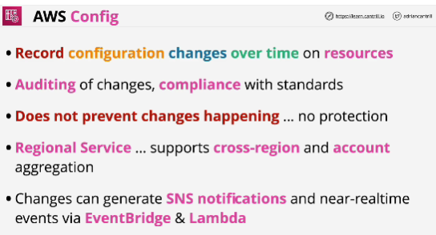
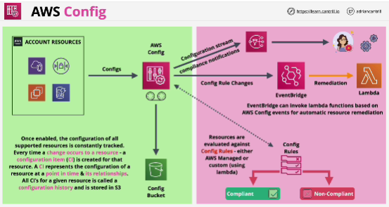

- **AWS Config** is a service which records the configuration of resources over time (configuration items) into configuration histories.

- Primary function: to record changes over time on resources within AWS account.
Once enabled, the configuration of every resource in the account is monitored. 

Every time a resource configuration changes, a configuration item is created which stores the configuration of that resource at a specific point in time. 

The information which is stored is the configuration of the resource, the relationship to other resources and who makes any changes. 

- It's not a permissions product or a protection product.

- Custom rules use Lambda to evaluate if resources match criteria.

