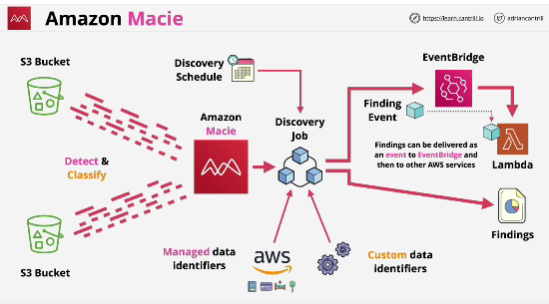
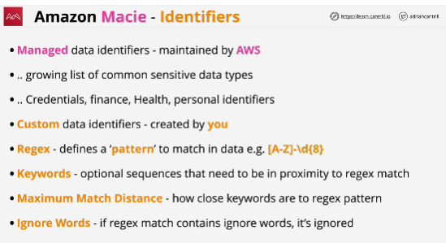
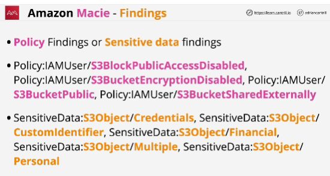

- **Amazon Macie** is a fully managed data security and data privacy service that uses machine learning and pattern matching to discover and protect your sensitive data in AWS.

- Amazon Macie is a service which can be used to discover, monitor, and protect data, which is stored within S3 buckets.

- First job of Macie is to identify and inventory data. Using Macie you know what you have, what it contains and where it is.
The way that it does is using **data identifiers** (rules which your objects and their contents are assessed against)

Two types of data identifiers:

1. **managed data identifiers**: can be used to detect almost all common types of sensitive data that you might need to manage within your organization

2. **custom data identifiers**

- Macie uses **multi-account** architecture: one account is the administrator account and that can be used to manage Macie within member accounts

- Within **discover job** we can specify which buckets we want to analyze, which means detectting and classifying data within those buckets.

Discover job has a schedule: this controls when it runs and how frequently it runs and then job uses a combination of managed data identifiers and custom data identifiers.

- **Findings**: output to the discovery job

- To discover sensitive data within Amazon Macie, you create and run data discovery jobs.

A data discovery job analyzes objects within S3 buckets to determine whether the objects contain sensitive data.

The way that it does is via **data identifiers**.

