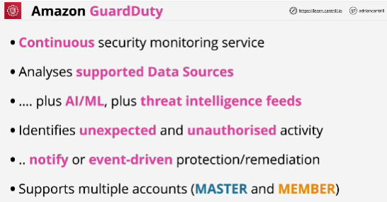
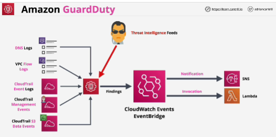

- **Guard Duty** is an automatic threat detection service which reviews data from supported services and attempts to identify any events outside of the 'norm' for a given AWS account or Accounts.

- Once enabled, it's running all the time, trying to protect your account and resources from any security issues. 

- It learns patterns of what happens normally within any managed accounts. 

