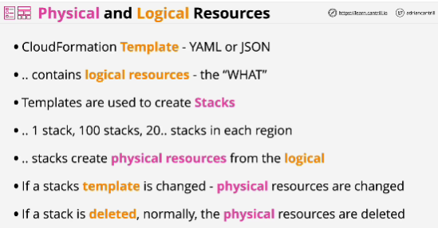
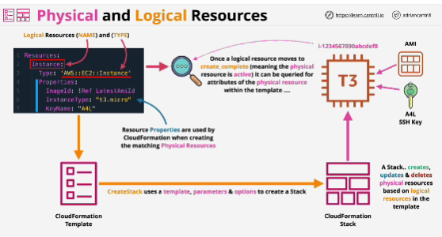
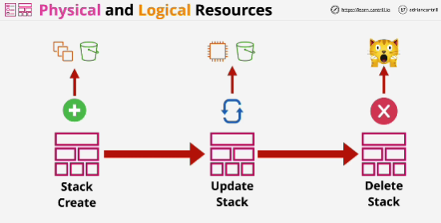

- **CloudFormation** defines logical resources within templates (using YAML or JSON). The logical resource defines the WHAT, and leaves the HOW up to the CFN product. A CFN stack creates a physical resource for every logical resource - updating or deleting them as a template changes.

- You focus on **what** you want to create, CloudFormation deal with **how** to create. 

- One template defines what resources you want, and defining good template means a template can be used many times in many accounts in many regions.

- Initial job of a Stack is to create physical resources based on the logical resources defined within the template.

- For every logical resource in a template, when a Stack is created, a physical resource is also created.

- CloudFormation templates are used to create CloudFormation Stacks. 
Stacks job is to create, update or delete physical resources based on what's contained in that template.

- CloudFormation lets you automate infrastructure.

