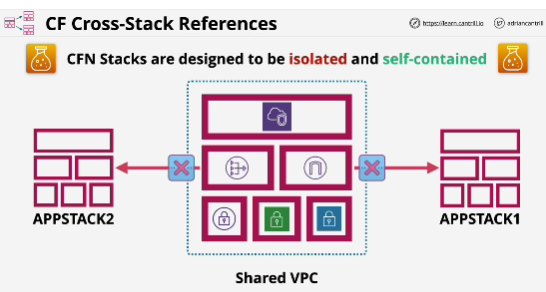
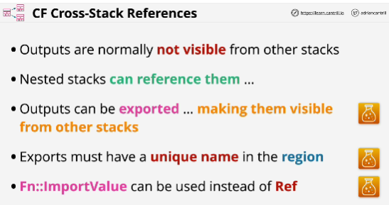
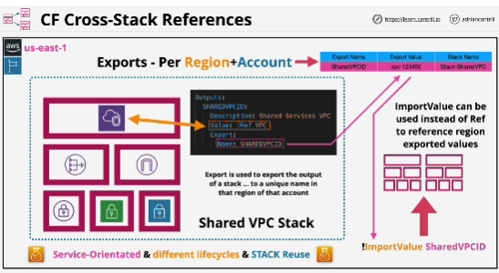

- **Cross stack references** allow one stack to reference another

Outputs in one stack reference logical resources or attributes in that stack

They can be exported, and then using the !ImportValue intrinsic function, referenced from another stack.

- Export name needs to be unique inside one region of your account.

- Within the exports list, any of the exports need to be unique.

- Once a value is in the exports list, it can be referenced in other stacks using the **importValue** function. This function replaces the Ref function 

When importValue function is used in a stack allows you to reference values which are exported from other stacks and added to the exports list.
This only works in the same region as a stack is being applied in.

Cross-region or cross-account isn't supported for cross-stack references.

- A template is used to create one or more stacks, each stack is unique.
If you want to reuse a template, then you can choose to use nested stacks which allow you to use the same template that you've created once in many distinct architectures.

