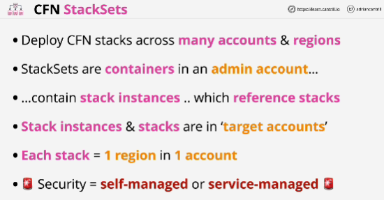
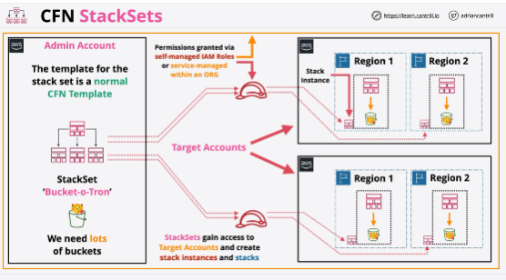
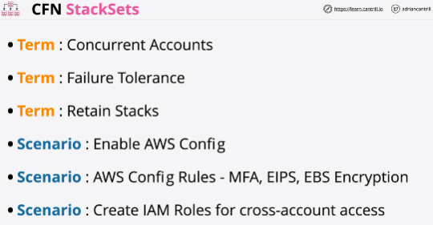

- Allows you to create, update or delete infrastructure across many regions potentially in many AWS accounts.

- Stack instances reference one particular stack in one particular region in one particular AWS account.

- **Stack set** can containt many stack instances.

- **Service-managed** roles are where we use CloudFormation in conjunction with AWS organizations, so all of the roles get created on your behalf by the product behind the scenes.

- **Concurrent Accounts** is an option that you can set when creating a stack set and this defines how many individual AWS accounts can be used at the same time.

- **Failure Tolerance** is the amount of individual deployments which can fail before the stack set itself is viewed as failed.

- **Retain Stacks**: you're able to remove stack instances from a stack set and by default it will delete any of the stacks that are in the target accounts.

