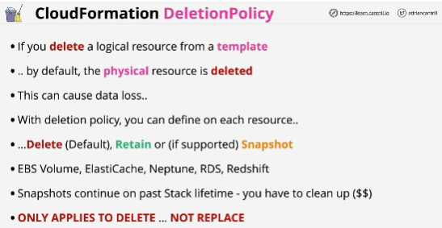
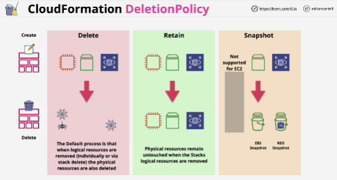

- **Default**: CloudFormation will delete a physical resource when corresponding logical resource is deleted.

- **Retain**: CloudFormation will not delete physical resource if the corresponding logical resource is deleted.

- **Snapshot**: for a small subset of supported resources.
When you specify the Snapshot option, then before the physical resource is deleted, a snapshot of that resource is taken. Not supported for EC2 instances.

