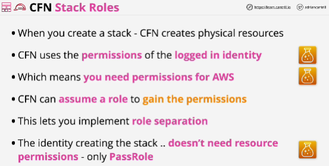
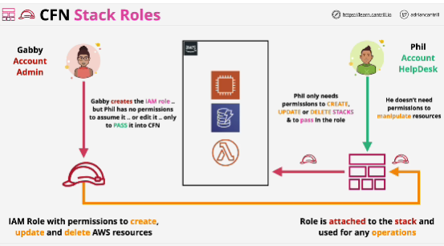

- **Stack roles** allow an IAM role to be passed into the stack via PassRole

A stack uses this role, rather than the identity interacting with the stack to create, update and delete AWS resources.

It allows role separation and is a powerful security feature.

- Where an identity needs to use CloudFormation to do things that they wouldn't otherwise be allowed to do outside of CloudFormation - Stack roles is solution!

