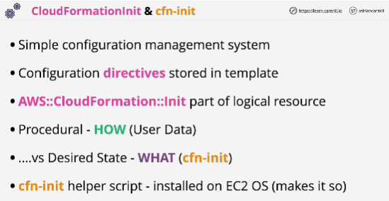
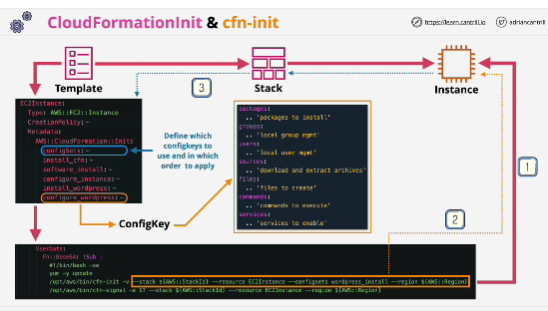

- CloudFormationInit and cfn-init are tools which allow a desired state configuration management system to be implemented within CloudFormation.

- Use the **AWS::CloudFormation::Init** type to include metadata on an Amazon EC2 instance for the cfn-init helper script. If your template calls the cfn-init script, the script looks for resource metadata rooted in the AWS::CloudFormation::Init metadata key. cfn-init supports all metadata types for Linux systems & It supports some metadata types for Windows.

- It's **idempotent**: if something is already in a certain state, running CloudFormation::Init will leave it in that same state.

- cfn-init helper tool is executed from the user data.

- Within CloudFormation::Init you'll define one set of config.

