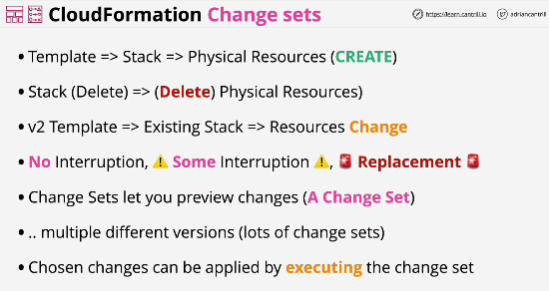
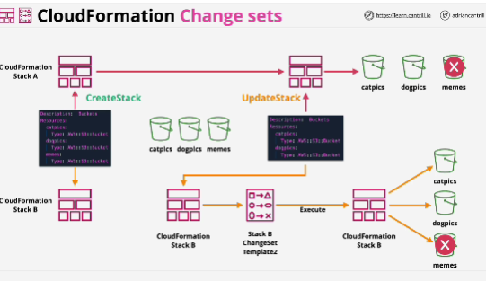

- Feature which makes safer to use CloudFormation within a full infrastructure as code environment or when CICD processes are being used within your organization.

- **No interruption** is why certain changes made to a stack might not impact the operation of the physical resource.

- **Some interruption**: like EC2 rebooting; it's not damaging event, but it can impact service.

- **Replacement** creates a new copy of that physical resource and the old one is removed.
This is disruptive and can result in data loss.

