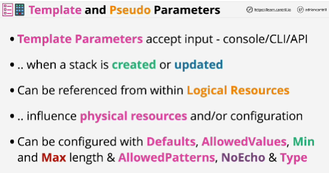
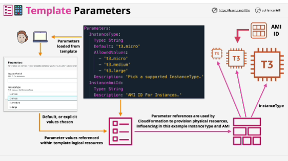
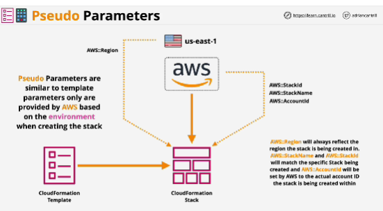

- For every parameter that you define in a template, you can provide configuration for that specific parameter.

- The thing unique to template parameters is that the personal process provides values into CloudFormation, either explicitly or by implicitly accepting the defaults.

- Pseudo parameters are provided by AWS. AWS make available parameters which can be referenced, and these exist even if you don't define them in the parameters section of the template.

