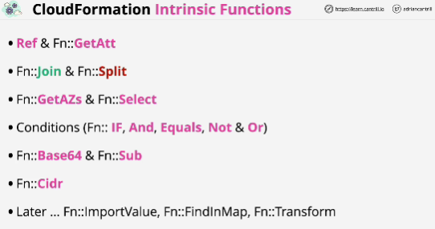
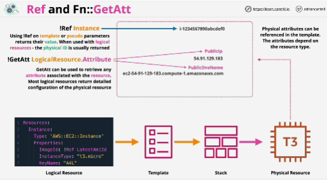
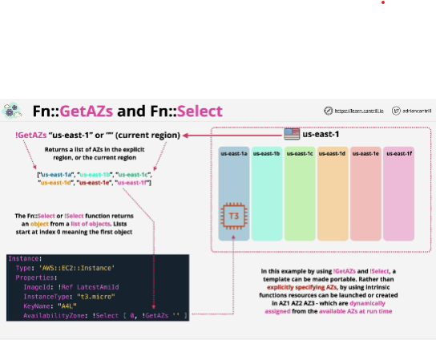
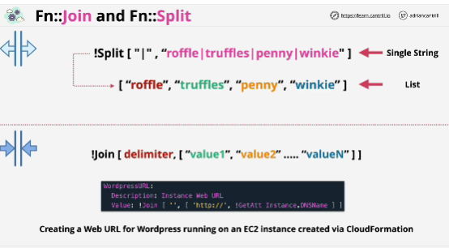
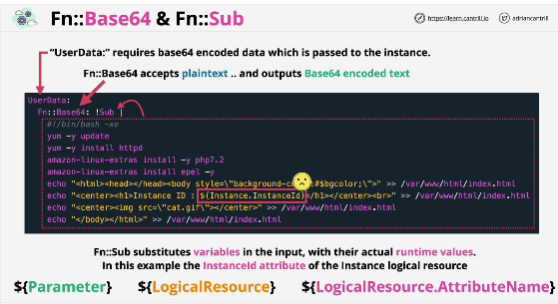
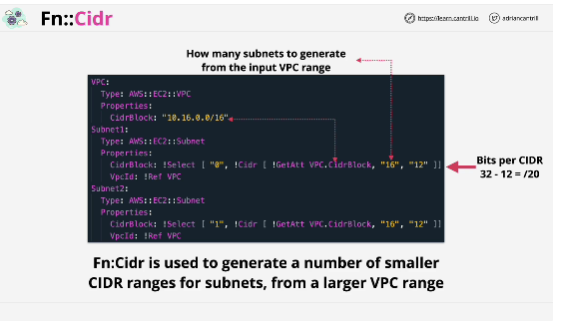

- Use **intrinsic functions** in your templates to assign values to properties that are not available until runtime.

- **Ref** and **get** atributes allow you to reference a value from one logical resource or parameter in another one.

- **join** and **split** allow you to join strings together or split them up (create an EC2 instance which is given a public IP version for DNS name then you can use the join function to create a web URL that anyone can use to access that resource)

- **getAZs** which can be used to get a list of availability zones for given AWS region; environmental awareness function
- **selct** allows you to select one element from that list 

- conditions

- **base64** and **sub**: base64 accepts non-encoded text and it outputs base64 encoded text that you can then provide to that resource; 
sub allows you to substitute things within text based on runtime information

**cidr** lets you build CIDR blocks for networking

- Split accepts a single string value and a delimiter pipe and it outputs a list 

- Join is the reverse of split: you provide a delimiter and a list of values and the join function joins them together to make a string.

- Base64 and sub: a script that you provide to instances which allow them to perform auto configuration.
Sub: allows you to do replacements on variables; you can't do self-references

- cidr: it's all based on the parent VPC CIDR range and it can't allocate or unallocate ranges

