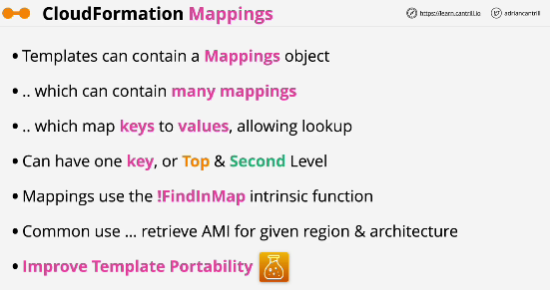
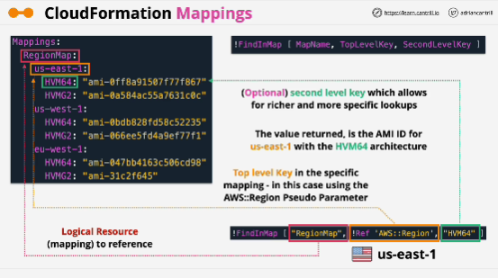

- The optional **Mappings** section matches a key to a corresponding set of named values. 

For example, if you want to set values based on a region, you can create a mapping that uses the region name as a key and contains the values you want to specify for each specific region. You use the Fn::FindInMap intrinsic function to retrieve values in a map.

- First, we have to use **!FinfInMap** function: we need to specify the name of mapping that we're going to use. 

**We always need to provide at least one top level key.**

