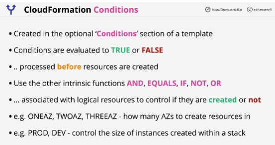
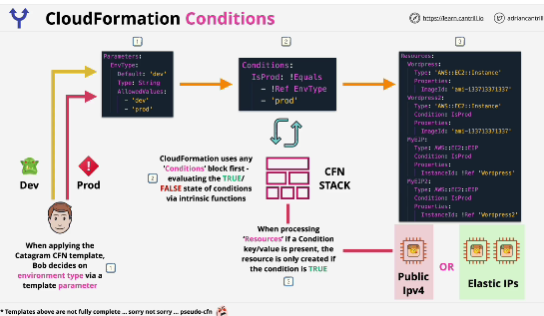

- Allows a stack to react to certain conditions, and change infrastructure which is deployed, or specific configuration of that infrastructure, based on conditions.

- If a condition that's associated with a resource is true, then that logical resource is created, if it's not, then resource is not created.

